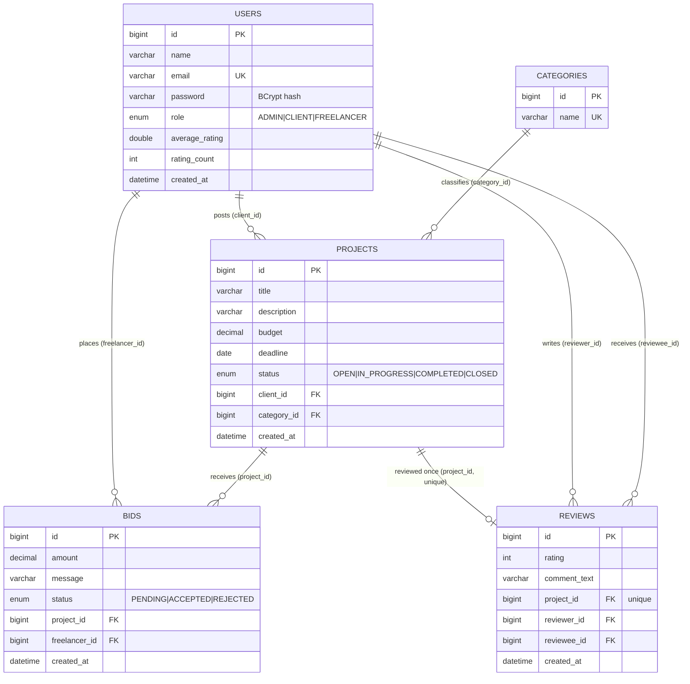

# ER Diagram (render in GitHub / VS Code Mermaid preview / mermaid.live, export as PNG for the report)

```mermaid
erDiagram
    USERS ||--o{ PROJECTS : "posts (client_id)"
    USERS ||--o{ BIDS : "places (freelancer_id)"
    CATEGORIES ||--o{ PROJECTS : "classifies (category_id)"
    PROJECTS ||--o{ BIDS : "receives (project_id)"
    PROJECTS ||--o| REVIEWS : "reviewed once (project_id, unique)"
    USERS ||--o{ REVIEWS : "writes (reviewer_id)"
    USERS ||--o{ REVIEWS : "receives (reviewee_id)"

    USERS {
        bigint id PK
        varchar name
        varchar email UK
        varchar password "BCrypt hash"
        enum role "ADMIN|CLIENT|FREELANCER"
        double average_rating
        int rating_count
        datetime created_at
    }
    CATEGORIES {
        bigint id PK
        varchar name UK
    }
    PROJECTS {
        bigint id PK
        varchar title
        varchar description
        decimal budget
        date deadline
        enum status "OPEN|IN_PROGRESS|COMPLETED|CLOSED"
        bigint client_id FK
        bigint category_id FK
        datetime created_at
    }
    BIDS {
        bigint id PK
        decimal amount
        varchar message
        enum status "PENDING|ACCEPTED|REJECTED"
        bigint project_id FK
        bigint freelancer_id FK
        datetime created_at
    }
    REVIEWS {
        bigint id PK
        int rating
        varchar comment_text
        bigint project_id FK "unique"
        bigint reviewer_id FK
        bigint reviewee_id FK
        datetime created_at
    }
```
